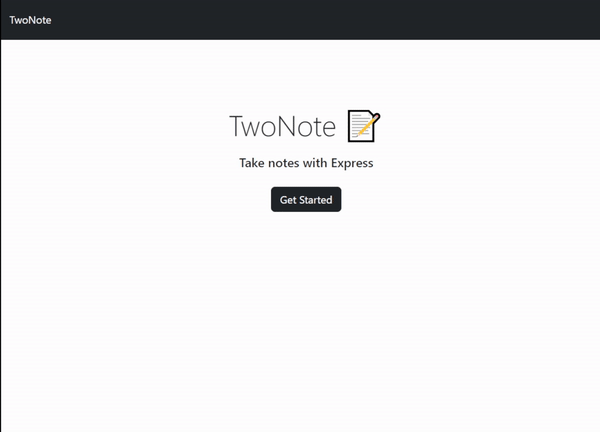

# TwoNote

## Description 📜
>TwoNote is an easy-to-use note taking web application designed to streamline and simplify basic notes such as daily tasks. With TwoNote, a user can enter any number of tasks into the field, save them, review and delete them as they please. Note taking has never been easier. 

## Installation 💿
1. Navigate to the link found [here](https://twonote.herokuapp.com/)
2. Click `Get Started`
3. Click the plus sign to begin writing your note title and text
4. Click the save icon located at the top right to store your note
5. Click on your note titles at the side menu to cycle through your notes
6. Click the trash can icon beside your note title to delete the note

## Technologies Used: ⚡

* Node.JS
* Express.js
* VS Code
* Heroku
* Bootstrap

---

---

## License 🔑

MIT License

Copyright (c) 2023 Mario Repas

Permission is hereby granted, free of charge, to any person obtaining a copy
of this software and associated documentation files (the "Software"), to deal
in the Software without restriction, including without limitation the rights
to use, copy, modify, merge, publish, distribute, sublicense, and/or sell
copies of the Software, and to permit persons to whom the Software is
furnished to do so, subject to the following conditions:

The above copyright notice and this permission notice shall be included in all
copies or substantial portions of the Software.

THE SOFTWARE IS PROVIDED "AS IS", WITHOUT WARRANTY OF ANY KIND, EXPRESS OR
IMPLIED, INCLUDING BUT NOT LIMITED TO THE WARRANTIES OF MERCHANTABILITY,
FITNESS FOR A PARTICULAR PURPOSE AND NONINFRINGEMENT. IN NO EVENT SHALL THE
AUTHORS OR COPYRIGHT HOLDERS BE LIABLE FOR ANY CLAIM, DAMAGES OR OTHER
LIABILITY, WHETHER IN AN ACTION OF CONTRACT, TORT OR OTHERWISE, ARISING FROM,
OUT OF OR IN CONNECTION WITH THE SOFTWARE OR THE USE OR OTHER DEALINGS IN THE
SOFTWARE.